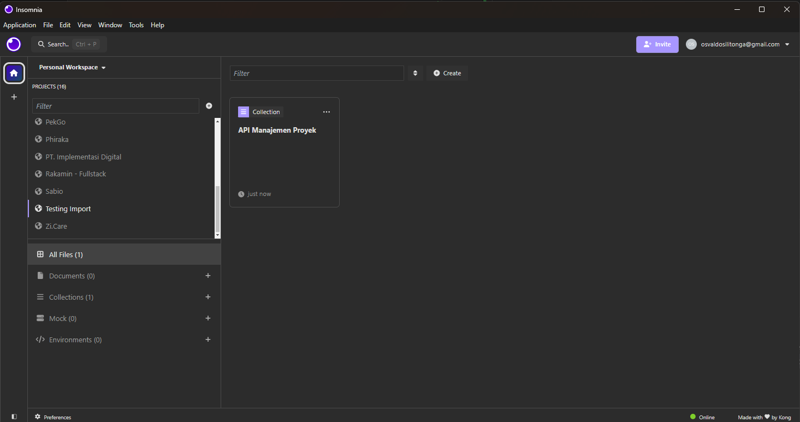

# Project Manajemen

## Tech Stack
- Node JS
- Express
- Mongoose
- MongoDB

## How to Run
Clone repo
```bash
$ git clone https://github.com/osvaldosilitonga/API-Manajemen-Proyek.git
```

Set configuration `.env`, example:
```env
MONGODB_URI="mongodb://host.docker.internal:27018/manajamen_proyek"
```

Run Docker Compose
```bash
$ cd ./app

$ docker-compose up --build
```

## Docs
You can see API Specification in `./docs/api-spec.yml`.

To test the API, I have provided the insomnia.yaml file in the `./docs` folder

### How to import `.yaml` file
1. Click import on the insomnia application


2. Choose file `Insomnia_2024-07-30.yaml`, and click scan


3. Click `import`


4. Click API Manajemen Proyek collection


5. Done. Happy testing
